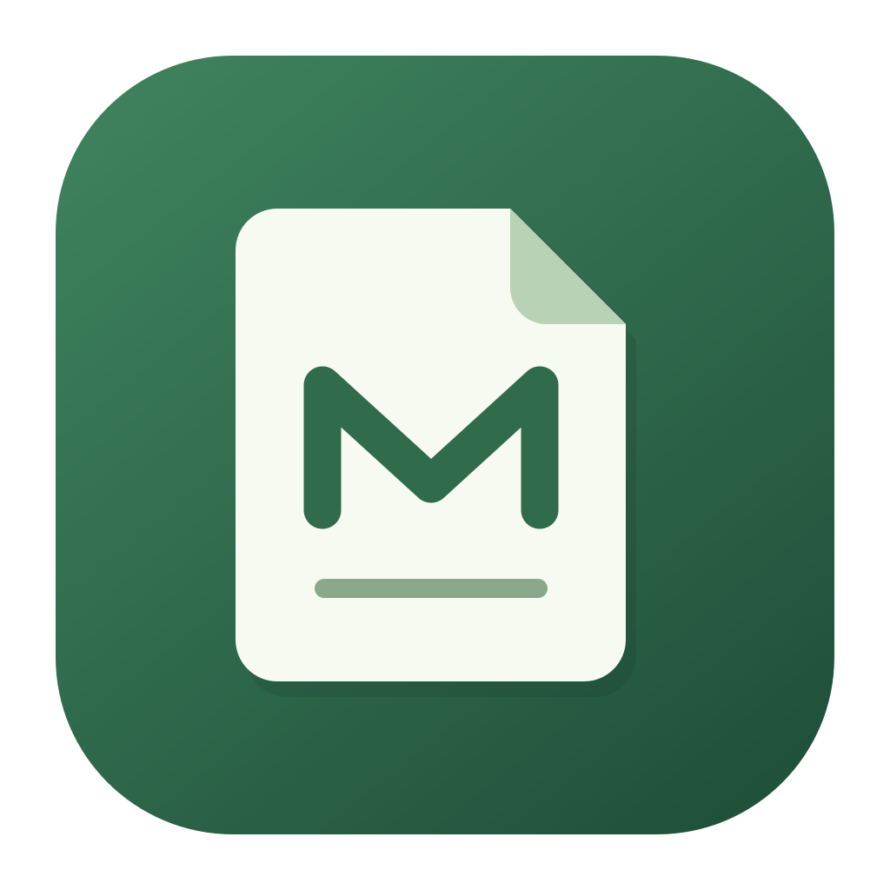

# MD Browser



桌面端 Markdown 浏览 / 编辑应用。连接远程 WebDAV 存储（如坚果云），随时随地浏览、编辑并保存你的 Markdown 文档。

## 功能特性

- 🔌 连接 WebDAV 远程存储（坚果云 / 自建 WebDAV 均可）
- 📁 浏览远程目录（文件夹优先排序）
- 📄 点击打开 `.md` 文档，实时渲染与舒适的中文排版
- ✏️ 编辑 + 实时预览（分屏 / 仅编辑 / 仅预览 三种视图）
- 💾 停止输入 2 秒后自动保存到远程，保留 `Cmd/Ctrl + S` 立即保存；文件名旁显示保存状态，失败时可点击重试
- 切换文件、断开连接和关闭窗口前先尝试保存；失败时提示保留本地草稿后离开
- 输入时即时备份本地草稿，按服务器、账号和文件隔离；重新打开同一文件时可选择恢复。如果远程内容已变化，恢复前会提示覆盖风险
- 暖白与墨绿界面、编辑区行号、字数和光标位置；连接配置收进侧栏弹窗
- 新建与重命名不覆盖同名文件；使用应用内命名弹窗并校验名称
- ➕ 新建文件 / 新建文件夹 / 重命名 / 删除
- 🔗 预览中的外部链接用系统浏览器打开
- 🛡️ 渲染经 DOMPurify 消毒，防止文档中的恶意脚本

## 运行方式

依赖已安装好（含 Electron 二进制），**无需安装 Node**，任选其一：

```bash
# 方式一：启动脚本
cd /Users/ljj/Documents/DSH/md-browser
./start.sh

# 方式二：直接调用 Electron 二进制
./node_modules/electron/dist/Electron.app/Contents/MacOS/Electron .
```

> 如果你之后安装了 Node，也可以用 `npm start` 或 `pnpm start`。

## 连接坚果云 WebDAV（示例）

1. 登录 [坚果云](https://www.jianguoyun.com)，进入「账户信息 → 安全选项」，找到「第三方应用管理」，**添加应用密码**，得到一串应用密码。
2. 点击左下角连接状态旁的齿轮，在弹窗中填写：
   - **WebDAV 地址**：`https://dav.jianguoyun.com/dav/`
   - **账号 / 邮箱**：你的坚果云账号邮箱
   - **应用密码**：上一步生成的应用密码（不是登录密码）
3. 点「连接」，左侧即显示远程目录。

> 其他 WebDAV 服务（自建 WebDAV、群晖、Nextcloud 等）填对应地址和账号密码即可。

## 导出 PDF

打开文档，点击右上角「··· → 导出 PDF…」，选择本机保存位置。导出使用当前编辑内容，包括尚未同步到远程的修改，不修改原文。

PDF 使用独立 A4 版式：左右约 22 mm、上下约 20 mm 页边距，11pt 正文，分级标题和页码。标题尽量与后文同页，段落控制孤行，表格跨页重复表头，代码长行自动换行，图片按纸张缩放。界面字号与预览边距不影响导出。图片加载失败会在 PDF 中标注并提示。

## 导入 PDF、Word 和文本

连接 WebDAV 后，点击左侧文件栏「导入」可多选文件，也可将一个或多个本地文件拖入窗口，上传到当前目录。支持 `.md`、`.markdown`、`.pdf`、`.docx`、`.txt`、`.text`（macOS 另支持 `.doc`）。另支持常见音乐、视频和图片原文件上传，暂不支持文件夹上传。

批量上传逐个处理并显示进度，可点击「停止」结束后续上传；单个失败不影响其余文件，结束时显示成功、失败和跳过明细。同名文件会提示改名，取消则跳过该文件，不覆盖远程内容。批量上传保留当前阅读文档，单文件上传后自动预览。

- 选择 `.pdf`：保留 PDF 格式和原始字节，确认名称后直接上传到当前目录，不转换为 Markdown。最大 50 MB。
- 选择 `.docx`：保留 Word 原格式上传，直接在应用内单页编辑。
- 选择 `.txt` 或 `.text`（macOS 也支持旧版 `.doc`）：转换为 Markdown 后上传。

导入后自动打开预览。同名文件会提示更换名称，不覆盖原文件。点击目录里已有的 PDF 也可以直接预览。PDF 默认在阅读与标注界面打开，无需切换模式：顶部不显示标注工具栏；选中文字后出现悬浮工具栏，提供复制、高亮和下划线。底部仅保留页码及「···」阅读菜单，菜单内提供保存、撤销、清除全部标注、缩放和适应宽度。⌘Z / Ctrl+Z 可撤销新增、删除或清空标注；点击已有标注，在悬浮菜单中删除。⌘S / Ctrl+S 或「保存 PDF」直接覆盖当前 WebDAV 原文件，并在保存前检查远程内容，冲突或失败时保留未保存修改。文本高亮与下划线使用 PDF 原生标注，保留原文。清除全部只移除原生标注，保留链接和表单；早期已合入页面图片的标注无法单独删除。未保存的标注在离开时会提醒。需要打印、下载或缩略图时，可在底部「···」菜单中点击「原版阅读器」。PDF 阅读区支持 Ctrl + 鼠标滚轮缩放：向上放大、向下缩小，范围为适宽比例的 50%–300%；也可通过底部菜单恢复适宽。PDF 不使用 Markdown 编辑和自动保存。PDF 可以通过右键重命名、移动和删除，重命名会保留 `.pdf` 扩展名。

- 旧版 `.doc` 的转换尽量保留标题、加粗、列表、链接、表格和常见图片；图片内嵌到 Markdown，无需单独上传。
- 合并单元格等复杂表格使用内嵌 HTML；部分 Word 排版及特殊图形无法完整保留，出现转换限制时会提示。
- 文本支持 UTF-8、带 BOM 的 UTF-16 和常见 GB18030 中文编码。单文件最大 20 MB。
- 转换在本机执行，只将确认导入的文件上传到当前 WebDAV；本地原文件不修改。

## 音乐、视频与图片

点击文件即可在右侧播放或查看，左侧保留文件列表。

- 音乐：播放器提供播放/暂停、进度和音量；当前目录中的音频组成播放列表，可切换上一首/下一首。默认顺序播放，到最后一首停止；「单曲循环」开关会记住上次选择，开启后重复当前曲目。
- 视频：提供播放/暂停、进度和音量；点击「全屏」或双击画面进入全屏，点击「退出全屏」或按 Esc 返回。
- 图片：支持上一张/下一张、放大缩小、适应窗口、90° 旋转，Ctrl+滚轮也可缩放。旋转与缩放只影响查看，不修改 NAS 原图。
- 支持识别 MP3、WAV、OGG、FLAC、M4A、AAC 等音频，MP4、WebM、MOV、MKV 等视频，以及 JPG、PNG、GIF、WebP、BMP、AVIF 图片。音视频能否播放取决于实际编码与当前 Electron 的解码能力，不提供自动转码。
- 音视频通过 WebDAV 流式读取，进度拖动依赖服务器对 HTTP Range 的支持。切换文件、断开连接会停止当前播放并释放读取连接。
- 媒体可通过「导入」多选或拖拽上传，保留原格式。单个媒体文件最大 2 GB，上传通过文件流完成；同名不覆盖。

## Word 原格式编辑

点击目录中的 `.docx`，右侧显示一个可直接阅读、编辑的页面，左侧保留文件列表，不分编辑与预览两栏。支持普通段落文字删改、Enter 分段、Backspace/Delete 在段落边界合并、纯文本粘贴、段落增删、左/中/右/两端对齐、首行缩进、行距及段前段后间距。Shift+Enter 在同一段落内换行；Ctrl+Z 撤销，Ctrl+Y 或 Ctrl+Shift+Z 重做。

点击「保存 Word」或按 Ctrl/Cmd+S 保存到原 WebDAV 文件，仍为 DOCX，不转换成 Markdown。切换文档、断开连接或关闭窗口前会尝试保存；保存失败时保留当前编辑内容并询问是否离开。Word 暂不自动保存或备份本地草稿，请及时保存；保存后撤销历史会重置。保存前检查远程内容和 ETag，远程已变化或服务器未提供 ETag 时拒绝覆盖。

此编辑器面向简单文字和段落排版，页面显示不保证与 Microsoft Word 的分页及复杂版式一致。图片、表格、列表、超链接、修订等复杂区域标记为受保护内容，不开放编辑；原包内这些内容及页眉页脚、样式等部件保留。普通段落修改尽量保留未改动文字的原有字体样式。受编辑保护的 DOCX 不开放编辑，旧版 `.doc` 请先另存为 `.docx`。

## 快捷格式

编辑区顶部提供标题、加粗、斜体、删除线、链接、图片、行内代码、代码块、无序列表、有序列表、待办、引用和分隔线。选中文字后点击即可应用；列表和引用可批量处理多行。

- `Cmd/Ctrl + B`：加粗
- `Cmd/Ctrl + I`：斜体
- `Cmd/Ctrl + K`：链接
- `Cmd/Ctrl + Z`：撤销格式操作

工具栏还提供字体（黑体、宋体、楷体、等宽）、文字字号和颜色。选中文字后设置，未选中文字时插入可替换的占位文字。字体与颜色使用 Markdown 内嵌 HTML 保存，在本应用预览和 PDF 中生效；部分外部 Markdown 阅读器可能忽略这些样式。

「首行缩进」为正文行添加两个全角空格，再次点击取消，支持选中多行。

插入格式同样触发本地草稿与自动保存。

## 使用说明

| 操作 | 方式 |
| --- | --- |
| 连接 / 断开 | 左侧连接卡片 → 连接设置弹窗 |
| 进入文件夹 | 点击列表中的文件夹 |
| 返回上级 | 点击列表顶部的 「返回上级」 或面包屑 |
| 打开文档 | 点击列表中的 `.md` 文件 |
| 编辑 | 中间编辑，右侧实时预览 |
| 保存 | 停止输入 2 秒自动保存，或按 `Cmd/Ctrl + S` 立即保存 |
| 切换视图 | 右上角「分屏 / 编辑 / 预览」 |
| 滚轮缩放 | 鼠标放在编辑区或预览区，按住 Control 滚轮向上放大、向下缩小；两个区域独立记忆字号 |
| 预览字号 | 预览栏的 A− / A＋，支持 12–28px；点击中间字号恢复 14px，自动记住选择 |
| 新建文件 / 文件夹 | 左侧文件栏的加号 / 文件夹图标 |
| 重命名 / 删除 | 右键文件或文件夹；当前文档也可用右上角「···」菜单 |
| 移动到其他目录 | 右键文件或文件夹 →「移动到…」→ 浏览目标目录 →「移动到此目录」 |

右键菜单支持未打开的文件和文件夹。移动和重命名不会覆盖同名目标，也不能把文件夹移入自身或子目录。目录变动会同步更新当前文档路径及相关本地草稿；删除文件夹会确认后删除全部内容和相关草稿。

## 目录结构

```
md-browser/
├── electron/
│   ├── main.js        # Electron 主进程 + IPC 路由
│   ├── preload.js     # contextBridge 安全桥接
│   └── webdav.js      # WebDAV 客户端封装（存储层，可替换）
├── renderer/
│   ├── index.html     # 界面结构
│   ├── style.css      # 界面样式 + Markdown 预览样式
│   └── app.js         # 界面逻辑
├── test/
│   ├── mock-webdav.mjs # 本地 WebDAV mock 服务器
│   └── test-webdav.mjs # 客户端层集成测试
├── start.sh           # 启动脚本（无需 Node）
└── package.json
```

## 测试

```bash
# 客户端层集成测试（需 Node，用 DSH 自带 node 或系统 node）
node test/test-webdav.mjs

# 界面状态回归测试（自动保存、草稿恢复、网络失败、连接隔离）
node test/test-renderer.mjs

# 冒烟测试（验证应用能启动、渲染链路正常）
MD_BROWSER_SMOKE=1 ./node_modules/electron/dist/Electron.app/Contents/MacOS/Electron .
# 看到 SMOKE_OK 即通过

# Electron + 本地 WebDAV 端到端测试，并生成实际界面截图到 output/
./node_modules/electron/dist/Electron.app/Contents/MacOS/Electron test/test-ui.cjs
```

## 技术栈

- **Electron** 33（桌面壳）
- **webdav** 5（WebDAV 客户端，主进程直连）
- **marked** 12（Markdown 渲染）
- **DOMPurify**（输出消毒，防 XSS）

## 已知限制 / 后续可做

- 相对路径图片（``）暂不能加载，绝对 URL 图片可以；后续可把资源下载到本地再渲染。
- 代码块暂无语法高亮；可引入 highlight.js。
- 连接成功后记住最近一次连接信息，密码通过 Electron safeStorage 使用系统加密能力保存到本机；下次启动自动填入并连接；没有已保存连接时手动设置，连接失败时可手动重试。断开连接保留密码，可在连接设置中点击「清除已保存密码」。系统加密不可用时仅连接，不保存明文密码。
- 本地草稿存在 Electron 用户数据目录的 localStorage 中。清除应用数据会清除草稿。
- 尚不支持多端同时编辑的自动合并；恢复草稿时会检查远程内容是否变化，日常保存仍采用覆盖写入。
- 可打包成独立的 `.app`（带图标，双击即用），用 electron-builder 即可。

## 应用图标

矢量源文件为 `assets/logo.svg`，PNG 为 `assets/icon.png`，macOS 图标为 `assets/md-browser.icns`。侧栏、欢迎页和应用 Dock 图标使用同一设计。

修改 SVG 后，运行 `electron scripts/build-icons.cjs` 重新生成 PNG 和 ICNS。

不支持内置预览的文件可在右侧点击「使用系统默认程序打开」。软件下载原文件至系统临时目录中的 md-browser-open 文件夹，再交给关联程序打开；每次打开生成独立副本。外部修改不会自动同步回 WebDAV，请自行上传。未安装关联程序时会显示错误并允许重试。

PDF 默认采用上下连续滚动阅读，页码随滚动更新，也可使用上下箭头或输入页码跳转。支持 Ctrl＋滚轮缩放；页面按需渲染，远处页面释放画布内存，返回时恢复标注。

Ctrl＋滚轮按滚动距离连续调整视图大小：Word/PDF 为 10%–400%，图片为适应窗口大小的 5%–800%，Markdown 编辑/预览字号为 4–72px。Word 工具栏提供缩小、放大和恢复 100%；视图缩放不会修改 Word 文档的字号或排版。

Word 文字编辑支持字体、6–96 磅字号（半磅步进）、字体颜色、加粗、斜体、下划线和删除线。选中文字时仅修改选区，未选中文字时应用到当前段落，支持撤销/重做与 Ctrl+B/I/U 快捷键；Ctrl+S 保存回原 DOCX 文件。

### 按需双栏

软件启动默认单栏。顶部「开启双栏」可选择当前文件放左栏或右栏；点击目标栏后，从左侧文件列表选择文件，或右键选择「在左栏打开 / 在右栏打开」。双栏可分别编辑或查看 Markdown、Word、PDF、音乐、视频、图片等。中间分隔线可拖动调整宽度，也支持左右方向键微调、Home 恢复等宽。「交换左右」保留各栏编辑、滚动、缩放和播放状态；「恢复单栏」保留当前操作栏，并先检查另一栏的未保存修改。Ctrl+S 保存当前操作栏。同一文件不会同时在两栏重复编辑，选择已打开文件时会切换到已有栏。

Markdown 编辑区默认自动换行，随窗口或分栏宽度调整；行号仍按文件中的真实换行计数，显示换行不会改变文件内容。

### Windows 客户端打包

运行 `npm run dist:win` 生成 `dist/MD-Browser-<版本>-x64-Setup.exe`（安装版）与 `dist/MD-Browser-<版本>-x64-Portable.exe`（免安装版）。构建脚本在 `.electron-cache/release-app` 创建独立的发布依赖目录，以避免 pnpm 依赖收集遗漏；首次构建需要联网。程序自带 Electron，无需用户另装 Node.js。当前未配置发布者签名证书。

## 网页与阅读进度

- 顶部地球图标可在当前栏打开或返回网页；空白栏也有「打开网页」入口。每栏保留独立网页会话，切换文件后保留页面、滚动位置和前进/后退历史；点击网页关闭按钮或退出软件后清空。打开的页面和前进/后退历史只在本次运行保留；网站 Cookie、本地存储和缓存持久保存在本机，左右栏共享登录状态，关闭网页或退出软件不会主动清除。登录有效期仍由网站决定。
- Markdown/TXT、Word、PDF 的阅读位置，以及音视频播放时间、图片缩放和旋转状态保存在本机，重启软件后重新打开相同文件即可恢复。按连接及文件路径区分，不上传至 NAS。
- Markdown/TXT、Word 选中文字显示复制按钮；PDF 保留原有选中文字工具栏。支持 Ctrl+C；Markdown 和 Word 支持 Ctrl+V，Word 按纯文本粘贴。
- 网页仅允许 HTTP/HTTPS，使用不带应用预加载接口的沙箱容器；不向网页提供 NAS 账号密码。


### macOS 客户端打包

安装 Node.js 与 pnpm 后运行 `pnpm run dist:mac`。脚本按本机架构生成 `dist/MD-Browser-<版本>-mac-<架构>.dmg` 和 `.zip`。包内包含完整生产依赖；打包时逐文件校验归档，并启动打包后的应用，连接临时本机 WebDAV 服务验证目录、文本及 PDF 读写。测试使用临时账号数据，不连接真实网盘，也不写入系统钥匙串。测试失败时不会继续生成安装包。

应用使用本地临时签名，未做 Apple 公证。可单独运行 `node test/test-packaged-client.cjs "应用路径/MD Browser.app"` 复查客户端启动与连接。

### 离线字词与成语字典

在 PDF、Markdown 编辑区/预览区或 Word 正文中选中汉字、词语或成语（最多 32 字），悬浮菜单会显示「查字典」。查询卡片显示带声调拼音、多音字读音、中文释义、部首、笔画与繁体字；点击空白或按 Escape 关闭。查询不会修改文档，也不需要网络。词语显示整体拼音及释义；成语还显示字库中已有的出处、例句、用法和近反义词。PDF 选区中的空格、换行会自动忽略。未收录的词语明确提示，不会把单字读音拼成词语读音。内嵌网页和无文字层的扫描件不支持此入口。

词库来自 [mapull/chinese-dictionary](https://github.com/mapull/chinese-dictionary)，包含 21,056 个汉字基础条目，其中 16,221 个有释义。另包含 320,018 个词语与成语条目（其中成语 49,638 条），303,920 条有释义。部分生僻字词可能只有拼音或暂未收录。数据许可证及来源、转换说明和校验值位于 `assets/dictionary/`；保留上游 MIT 声明与其数据来源、准确性说明。该词库是社区整理数据，并非官方出版字典。

重新生成词库：准备上游 `char_base.json`、`char_detail.json`、`LICENSE` 后运行 `node scripts/import-dictionary.cjs <数据目录>`。运行 `pnpm run test:dictionary` 和 `pnpm run test:dictionary-ui` 可验证数据及选字交互。

扩展词库：准备上游 `word.json`、`idiom.json` 后运行 `node scripts/import-phrases.cjs <数据目录>`。按首字编码分为 256 个文件，查询时仅加载需要的分片并保留最近 8 个，避免启动时加载整个词库。词语数据来源和校验值见 `assets/dictionary/PHRASES-SOURCE.json`。

- 双栏支持将选中的文字拖拽复制到 Markdown/TXT 或 Word 的可编辑区域，显示插入光标，保留来源文字，支持多行文本与撤销；图片拖入不在此功能范围内。

### 思维导图

- 文件列表「＋ → 思维导图」或分栏空白区新建，自动补齐 `.smm` 后缀。导图可在任一栏编辑，原生文件支持上传、复制、改名和删除。
- 嵌入官方 SimpleMindMap 完整开源 Web 编辑器（Vue + Element UI），保留官方工具栏、主题缩略图、节点与基础样式面板、结构、大纲、设置、搜索、小地图和右键菜单。窄栏下部分工具收进「更多」。
- 使用上游 takeOverApp 接口接管文件读取和保存，复用 WebDAV 自动保存、Ctrl+S、本地草稿恢复和双栏切换。新建与导入在当前 NAS 目录另建 SMM 文件，保存写回当前文件。
- 滚轮缩放、左键拖动框选、右键移动画布；支持跨栏拖入文本副本成为子节点。多选节点后右击已选节点保留选择，可使用官方概要等操作。
- 官方开源界面提供图片、图标、链接、备注、标签、概要、关联线、外框、公式、格式刷和演示等工具。导入与导出的格式及兼容程度遵循上游转换器。
- 编辑器资源随客户端离线打包，无需打开官网；未加载官网统计脚本。主题、鼠标等偏好保存在本机。AI 默认关闭，若启用需自行配置兼容服务。
- 源码来源、归档校验值与 MIT 许可证见 renderer/vendor/simple-mind-map-web/。这是完整开源 Web 界面，不包含上游闭源桌面版专属功能。
- 集成测试：npm run test:mind-map，覆盖官方界面、双栏、主题保存、文字编辑、框选缩放、拖拽复制、新建导入和 WebDAV 保存。
